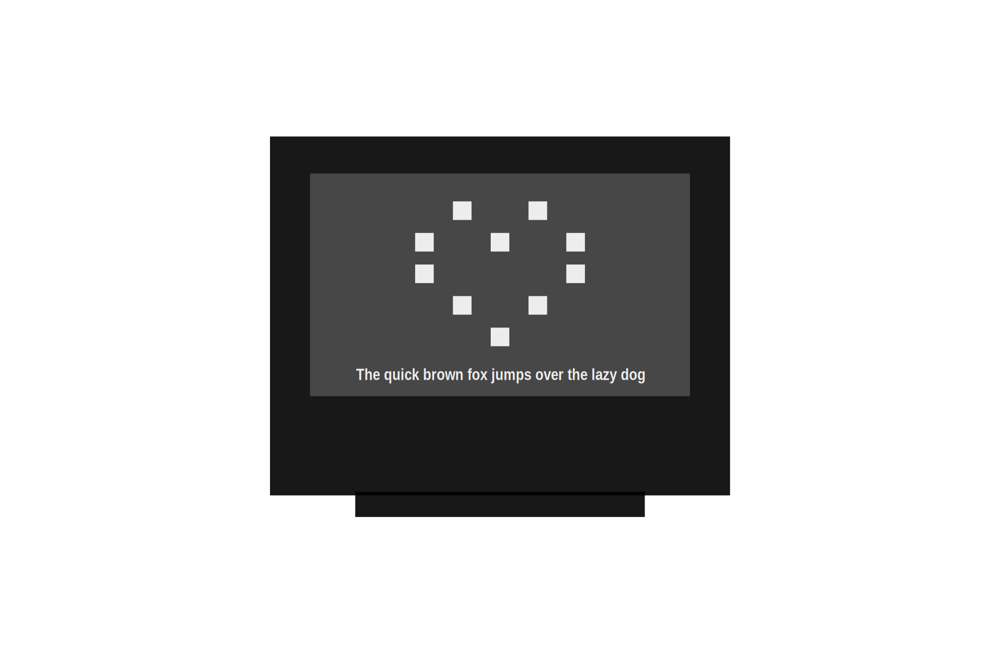

# Springbot • CWS (Core WiFi Springbot)
This is the Springbot core used in the Domino4 eco-system.
<table>
<tr style="background-color:#f47521;color:#ffffff;">
<th>Green</th><th>Gold</th>
</tr>
<tr style="background-color:#000;">
<td></td><td></td>
</tr>
<tr style="background-color:#f47521;color:#ffffff;">
<th>5x5 LED Array • :x: NFC</th><th>128x64 OLED • :white_check_mark: NFC</th>
</tr>
</table>

## On board sensors
- Digital X/Y/Z **Accelerometer** [Kionix **KX022-1022**](https://fscdn.rohm.com/kionix/en/datasheet/KX022-1020%20Specifications%20Rev%2012.0.pdf) on I2C Address **0x1F** (Interupt 1 on IO21)
- Digital **Temperature & Humidity** Sensor [Asair **AHT20**](https://asairsensors.com/wp-content/uploads/2021/09/Data-Sheet-AHT20-Humidity-and-Temperature-Sensor-ASAIR-V1.0.03.pdf) on I2C Address **0x38**
- Analog **Light** Sensor using **ADC1 Channel 6** on IO7 (Resolution: 12-bit (0–4095))

## I2C Addresses in use
| I²C address | Chip / function | Green | Gold |
|:---:|-----------------|:---:|:---:|
| 0x1F        | KX022-1020 accelerometer |:white_check_mark:|:white_check_mark:|
| 0x38        | AHT20 / AHT21 temperature & humidity sensor |:white_check_mark:|:white_check_mark:|
| 0x3C        | SSD1306 OLED display  |:x:|:white_check_mark:|
| 0x2D        | ST25DV NFC tag (secondary / special function address) |:x:|:white_check_mark:|
| 0x53        | ST25DV NFC tag – user EEPROM memory |:x:|:white_check_mark:|
| 0x57        | ST25DV NFC tag – system/configuration & UID area |:x:|:white_check_mark:|

## Programming in Arduino
To program the Domino4 cores using Arduino, install the board files using the doumentation from [Espressif](https://github.com/espressif/arduino-esp32)

- **Connection**: USB-C (preferred) or PPU V2
- **Board**: 'ESP32S3 Dev Module'
  - **Flash Size**: 8MB
- Using **PPU**:
  - **Speed**: Max 460800 bps
  - Chose the port where your PPU is inserted.
- Using **USB-C**:
  - **USB CDC on Boot**: Enabled
  - Chose the port where your Springbot is inserted.


Please read the notes regarding upload/transfer speed when using the [PPU](https://github.com/domino4com/PPU).
If you cannot see the port, the check out your [PPU installation](https://github.com/domino4com/PPU)

## Pin Usage
### Buttons 
#### Touch Buttons
| Symbol | GPIO | T# |
|:-----------------------------:|:----:|:--:|
| Ⓐ                | IO11 | T11|
| Ⓑ                | IO12 | T12|
|<span></span>| IO13 | T13|

#### Push Buttons on the back
| Symbol | GPIO | Function |
|:-----------------------------:|:----:|:--:|
| &#x25B6;              | IO0 | Program |
| &#x21BB;              | n/a | Reset |

#### Special buttons usage: 
- Instead of power cycle your circuit in order to restart your program, you can click the &#x21BB; button.
- By holding down &#x25B6; and clicking &#x21BB;, you can force the ESP32S3 into PROGRAM mode. If you feel you have any issues programming the core, then try this. The <font color="#f00">&#x2600;</font> will illuminate permanently. You have to manually reset the core once programmed, by clicking &#x21BB;.
- You can install a UF2 Bootloaded by visiting https://apps.springbot.co.za
- If you use the UF2 Bootloaded to install a UF2 prepared application, then double-click on &#x21BB;.   The <font color="#f00">&#x2600;</font> will pulse.
- The Springbot comes preloaded with the UF2 bootloader. If you program the core using Arduino, you will overwrite the bootloaded. Simply follow the instructions on https://apps.springbot.co.za to re-install the bootloader.

#### UF2 VID & PID
- **VID**:           0x303A
- **PID**:          0x82E4

### LEDs
#### Green only
| Postion | GPIO | 
|:-----------------------------|:----:|
|  Row 1 |IO8 |
|  Row 2 |IO17 |
|  Row 3 |IO10 |
|  Row 4 |IO38 |
|  Row 5 |IO6 |
|  Column 1 |IO3 |
|  Column 2 |IO2 |
|  Column 3 |IO14 |
|  Column 4 |IO15 |
|  Column 5 |IO16 |

#### Green & Gold on the back
| Postion | GPIO | 
|:-----------------------------|:----:|
|  Neopixel | IO39 | 
|  Red | IO40 | 

### Other Pins
| Function |  GPIO |Note|
|:-----------------------------|:----:|:--|
|  I²C SDA |IO5||
|  I²C SCL |IO4||
|  Serial TX |IO43||
|  Serial RX |IO44||
|  IO(1) pin |IO1||
|  IO2 pin |IO9||
|  IO3 pin |IO18||
|  Buzzer |IO33||
|  Phototransistor |IO7|ADC1 Channel 6|
|  IMU Interrupt |IO21|Interrupt #1 on the IMU|
|  NFC Interrupt |IO41|Only on Gold|
|  DblTap |IO42|Used in conjuction with .uf2 boot loader|

### SPI and SD Card
| SPI |  GPIO | MMC (Only on Gold) |
|:-----------------------------|:----:|:----:|
|  MISO |IO37|DAT0|
|  MOSI |IO35|CMD|
|  SCK  |IO36|CLK|
|  SD CS|IO34|DAT3|
| ... |IO16 | DAT1|
| ... |IO15 | DAT2|
| ... |IO3 | Card Detect|

## Programming in Python.
- Download the MicroPython firmware from [micropython.org](https://micropython.org/download/esp32/)
- It is recommended to download and use the (Mu Editor)(https://codewith.mu/en/download)
- You can use the Mu Editor to upload the MicroPython Firmware.

## Troubleshooting
- If you try to upload code and getting this message ```A fatal error occurred: Timed out waiting for packet content``` or ```A fatal error occurred: Invalid head of packet (0xE0)```, change the transfer speed to 460800 pbs.
- If you try to upload code and getting this message ```[7886] Failed to execute script esptool the selected serial port [7886] Failed to execute script esptool
does not exist or your board is not connected```, your serial port is open by another application. Close the other application and try again.

# License: 

Creative Commons Attribution-NonCommercial-ShareAlike 4.0 International Public License

[View License Deed](https://creativecommons.org/licenses/by-nc-sa/4.0/) | [View Legal Code](https://creativecommons.org/licenses/by-nc-sa/4.0/legalcode)

