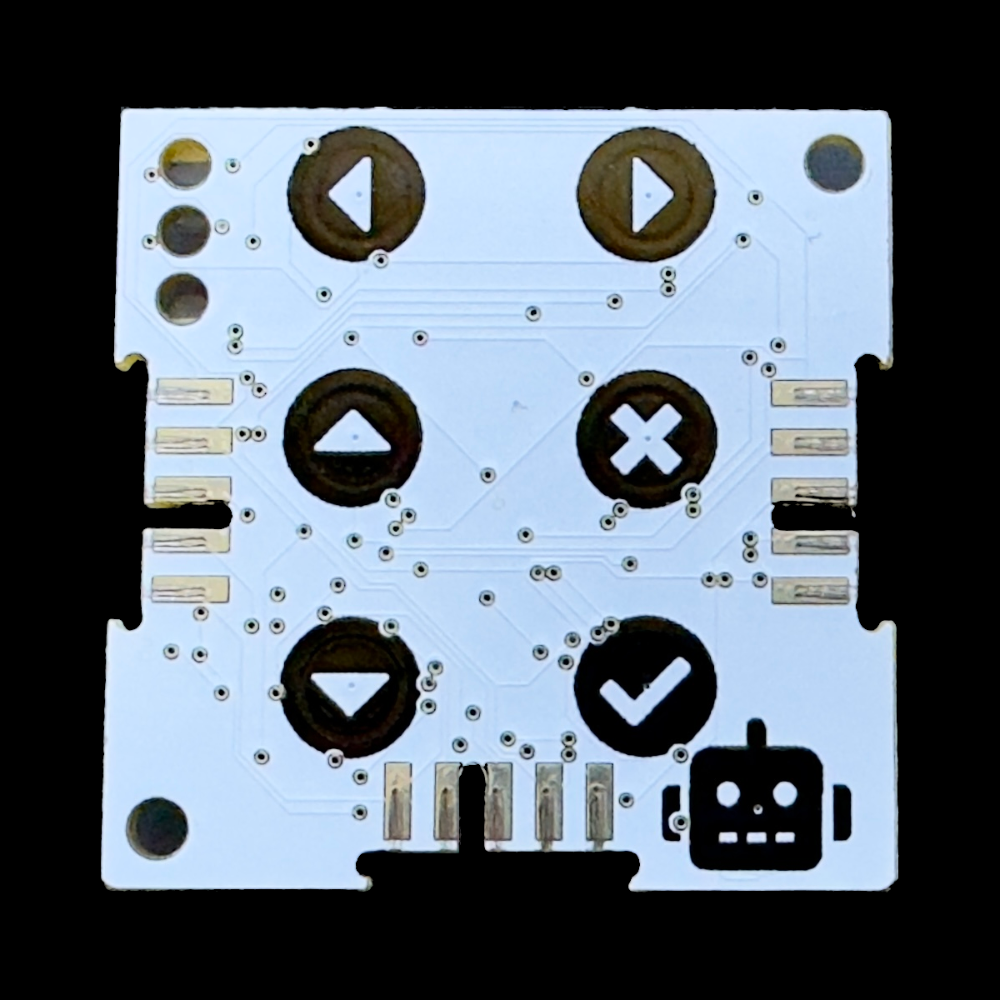
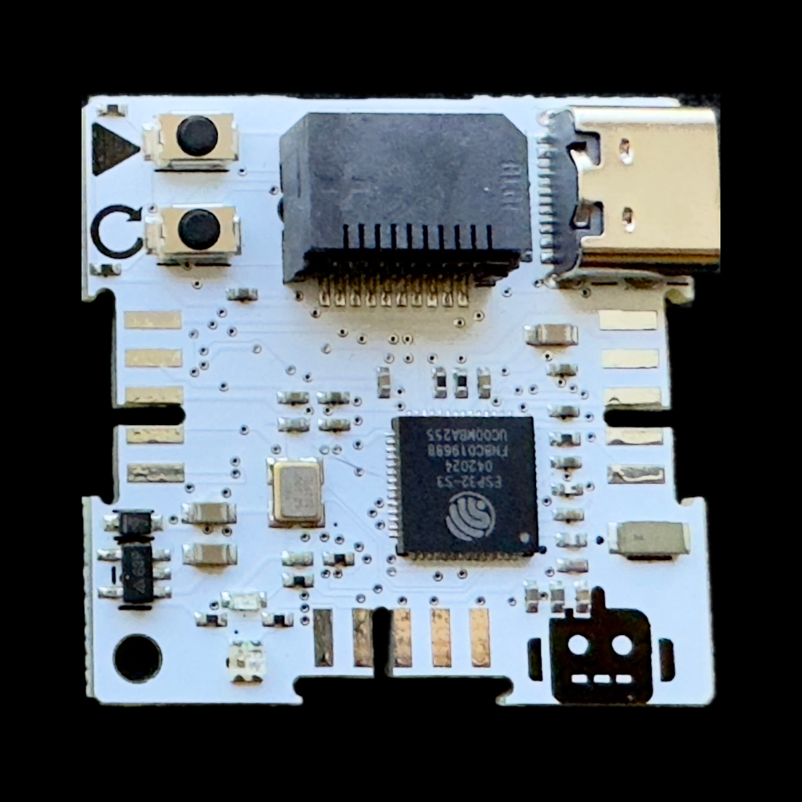

# Springbot • CWS (Core WiFi Springbot)
This is the springbot core used in the Domino4 eco-system.
<table>
<tr style="background-color:#f47521;color:#ffffff;">
<th>Green</th><th>Gold</th>
</tr>
<tr style="background-color:#000;">
<td></td><td></td>
</tr>
<tr style="text-align: center">
<td><a href=https://www.espressif.com/sites/default/files/documentation/esp32-wroom-32_datasheet_en.pdf>ESP32-WROOM-32</a></td><td><a href=https://www.espressif.com/sites/default/files/documentation/esp32-s3_datasheet_en.pdf>ESP32-S3(FN8)</a></td>
</tr>
<tr style="background-color:#f47521;color:#ffffff;">
<th>5x5 LED Array - No NFC</th><th>128x64 OLED - NFC</th>
</tr>
</table>

## Programming in Arduino
To program the Domino4 cores using Arduino, install the board files using the doumentation from [Espressif](https://github.com/espressif/arduino-esp32)
Connection: USB-C (preferred) or PPU V2

### Settings:
| Version | Green |   Gold |  
|-----------------------------:|:----:|:--:|
|Board: |'ESP32 Dev Module'|'ESP32S2 Dev Module'
|Flash Size:|4MB|8MB|
#### Using PPU
| Version | Green |   Gold |  
|-----------------------------:|:----:|:--:|
|Speed:| Max 460800 bps|Max 460800 bps|
| USB CDC on Boot: |n/a| Disabled|
|Port:|Chose the port where your PPU (v1) is inserted.|Chose the port where your PPU (v2) is inserted.|

Please read the notes regarding upload/transfer speed when using the [PPU](https://github.com/domino4com/PPU).
If you cannot see the port, the check out your [PPU installation](https://github.com/domino4com/PPU)
#### Using USB-C
| Version | Green |   Gold |  
|-----------------------------:|:----:|:--:|
|Speed:| n/a|inconsequential|
|USB CDC on Boot: |n/a| Enabled|
|Port:|n/a| Chose the USB-C port where your CWS is inserted.|

## Pin Usage
### Buttons 
#### Touch Buttons
| Symbol | GPIO | T# |
|:-----------------------------:|:----:|:--:|
| :arrow_left:                  | IO13 | T4|
| :arrow_right:                 | IO15 | T3|
| :arrow_up:                    | IO12 | T5|
| :arrow_down:                  | IO27 | T7|
| :white_check_mark:            | IO4  | T0|
| :negative_squared_cross_mark: | IO14 | T6|
| :robot:                       | IO33 | T8|
#### Push Buttons
| Symbol | GPIO | Function |
|:-----------------------------:|:----:|:--:|
| &#x25B6;                 | IO0 | Program |
| &#x21BB;              | n/a | Reset |

#### Special buttons usage: 
- Instead of power cycle your circuit in order to restart your program, you can click the &#x21BB; button.
- By holding down &#x25B6; and clicking &#x21BB;, you can force the ESP32S2 into PROGRAM mode. If you feel you have any issues programming the core, then try this. The <font color="#f00">&#x2600;</font> will illuminate permanently. You have to manually reset the core once programmed, by clicking &#x21BB;.
- You can install a UF2 Bootloaded by visiting https://apps.springbot.co.za
- If you use the UF2 Bootloaded to install a UF2 prepared application, then double-click on &#x21BB;.   The <font color="#f00">&#x2600;</font> will pulse.
- The Springbot comes preloaded with the UF2 bootloader. If you program the core using Arduino, you will overwrite the bootloaded. Simply follow the instructions on https://apps.springbot.co.za to re-install the bootloader.


### LEDs
#### Green
| Postion | Color | GPIO | On when|
|:-----------------------------|:----:|:--:|:--:
|  Top |Red| IO25 | Low |
|  Top |Blue| IO26 | Low |
|  Middle |Yellow| IO19 | High |
|  Bottom |Red| IO17 | Low |
|  Bottom |Green| IO18 | Low |

#### Gold
| Postion | Color | GPIO | On when|
|:-----------------------------|:----:|:--:|:--:
|  Top |Red| IO40 | High |
|  Bottom |RGB| IO39 | Neopixel |

### Other Pins
| Function |  GPIO V1 |GPIO V2+ | Notes|
|:-----------------------------|:----:|:----:|:--|
|  I²C SDA |21|17||
|  I²C SCL |22|18 ||
|  Serial TX |1|43 ||
|  Serial RX |3|44 ||
|  IO pin |2|1 |When used for capacitative sensing, refer to T2|
| DblTap |n/a|2|

### Expansion port (V2+ only)
| SPI |  GPIO | MMC | 
|:-----------------------------|:----:|:--|
|  MISO |38|DAT0|
|  MOSI |37|CMD |
|  SCK  |36|CLK |
|  X1   |35|DAT3 |
|  X2   |34|DAT1 |
|  X3   |33|DAT2 |


## Programming in Python.
- Download the MicroPython firmware from [micropython.org](https://micropython.org/download/esp32/)
- It is recommended to download and use the (Mu Editor)(https://codewith.mu/en/download)
- You can use the Mu Editor to upload the MicroPython Firmware.

## Troubleshooting
- If you try to upload code and getting this message ```A fatal error occurred: Timed out waiting for packet content``` or ```A fatal error occurred: Invalid head of packet (0xE0)```, change the transfer speed to 460800 pbs.
- If you try to upload code and getting this message ```[7886] Failed to execute script esptool the selected serial port [7886] Failed to execute script esptool
does not exist or your board is not connected```, your serial port is open by another application. Close the other application and try again.

# License: 

Creative Commons Attribution-NonCommercial-ShareAlike 4.0 International Public License

[View License Deed](https://creativecommons.org/licenses/by-nc-sa/4.0/) | [View Legal Code](https://creativecommons.org/licenses/by-nc-sa/4.0/legalcode)

